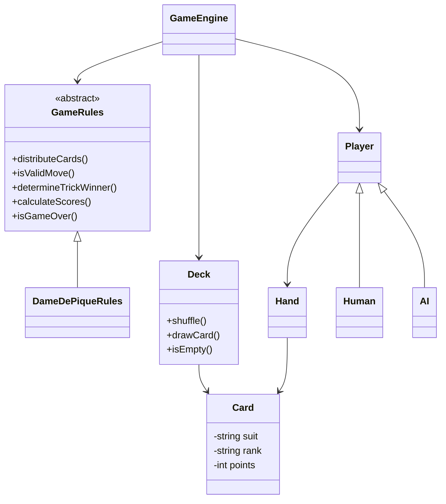

# JeuDePli

Projet C++ de programmation orientee objet autour d'un jeu de cartes a plis,
avec une premiere implementation des donnees et des regles de la Dame de
Pique.

## Etat actuel du projet

Le point d'entree actuel est `JeuDePli-master/main.cpp`. Le programme realise
un test d'importation :

1. il ouvre `dame_de_pique.json` ;
2. `DeckFactory` construit un `Deck` a partir du tableau `cartes` ;
3. chaque carte est ajoutee au paquet avec un `std::unique_ptr` ;
4. le programme pioche les cartes jusqu'a vider le paquet et affiche leur
   famille, leur valeur et leur nombre de points.

Les abstractions necessaires a une partie complete sont egalement presentes :
joueurs humains ou IA, main, pli, moteur de jeu et interface de regles. Leur
integration dans une partie jouable reste a finaliser.

## Architecture



### Roles des principales classes

- `Card` represente une carte avec une famille, une valeur et un nombre de
  points.
- `Deck` stocke les cartes, permet de les melanger et de les piocher. Il ne
  peut pas etre copie car il gere des `std::unique_ptr`, mais il peut etre
  deplace.
- `DeckFactory` charge un paquet depuis un fichier JSON et valide la presence
  du tableau `cartes`.
- `Hand` represente les cartes detenues par un joueur.
- `Player` est une classe abstraite commune aux joueurs humains et a l'IA.
- `GameRules` est une interface de strategie pour separer le moteur des
  regles d'un jeu particulier.
- `DameDePiqueRules` definit l'interface des regles de la Dame de Pique.
- `GameEngine` est prevu pour coordonner les joueurs, le paquet, les plis et
  les scores.

## Format des cartes

Le fichier `JeuDePli-master/dame_de_pique.json` contient le nom du jeu et une
liste de cartes. Chaque carte utilise les champs suivants :

```json
{
  "nomJeu": "Dame de Pique",
  "cartes": [
    { "famille": "Pique", "valeur": "Deux", "points": 0 },
    { "famille": "Coeur", "valeur": "Deux", "points": 1 }
  ]
}
```

`famille` et `valeur` sont des textes. `points` est un entier et vaut `0` si
le champ est absent. Le fichier doit contenir un tableau `cartes`.

## Prerequis

- Windows avec Visual Studio et le workload **Developpement Desktop en C++** ;
- un compilateur compatible C++20 ;
- la bibliotheque header-only [nlohmann/json](https://github.com/nlohmann/json),
  deja fournie dans `JeuDePli-master/json.hpp`.

## Lancer avec Visual Studio

1. Ouvrir `JeuDePli-master/JeuDePli.slnx`.
2. Selectionner la configuration `Debug` et la plateforme `x64`.
3. Definir le projet comme projet de demarrage si necessaire.
4. Compiler avec **Build > Build Solution**.
5. Lancer avec **Debug > Start Without Debugging** (`Ctrl+F5`).

Le fichier `dame_de_pique.json` doit etre trouve depuis le repertoire courant
du programme. Si l'executable est lance depuis un autre dossier, copier ce
fichier dans le repertoire d'execution ou ajuster le chemin dans `main.cpp`.

## Compilation manuelle

Depuis le dossier `JeuDePli-master`, une compilation GCC peut etre tentee avec
la commande suivante :

```powershell
g++ -std=c++20 -Wall -Wextra -pedantic main.cpp Deck.cpp DeckFactory.cpp Hand.cpp -o JeuDePli.exe
./JeuDePli.exe
```

Selon l'installation, l'inclusion de nlohmann/json peut necessiter de placer
le fichier fourni dans un dossier `nlohmann/json.hpp`, ou d'adapter
l'inclusion de `DeckFactory.cpp`.

## Resultat attendu

Pour le fichier de donnees fourni, la sortie ressemble a ceci :

```text
=== Demarrage du test d'importation ===
Tentative de lecture du fichier : dame_de_pique.json

Importation reussie ! Affichage du contenu du deck :
Carte 1 : ... de ... (Points : ...)
...
Test termine avec succes. Le deck est maintenant vide.
```

L'ordre des cartes peut varier si un melange est ajoute avant la pioche. Une
erreur est affichee si le fichier est introuvable ou si le JSON est invalide.

## Organisation des fichiers

```text
JeuDePli/
|-- README.md
|-- JeuDePli-master/
|   |-- main.cpp
|   |-- Card.h
|   |-- Deck.h / Deck.cpp
|   |-- DeckFactory.h / DeckFactory.cpp
|   |-- Hand.h / Hand.cpp
|   |-- Player.h
|   |-- Human.h / AI.h
|   |-- GameRules.h / DameDePiqueRules.h
|   |-- GameEngine.h
|   |-- Trick.h
|   |-- dame_de_pique.json
|   `-- json.hpp
`-- JeuDePli-master/JeuDePli.slnx
```
